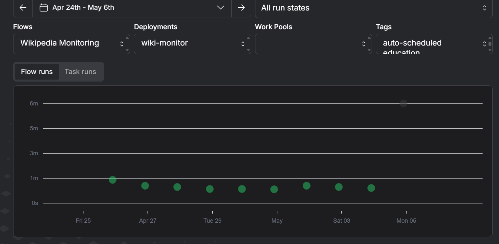
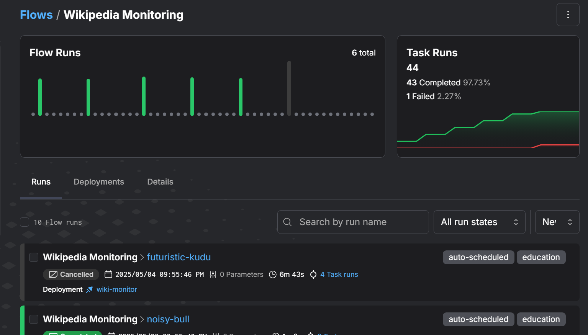
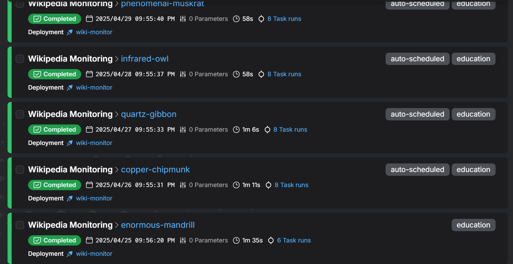
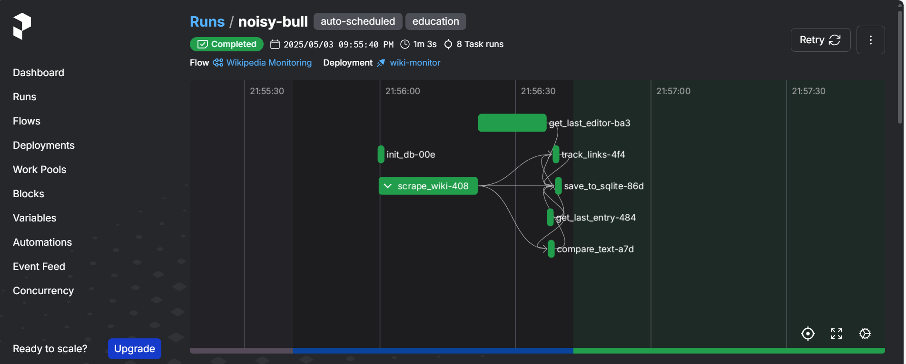
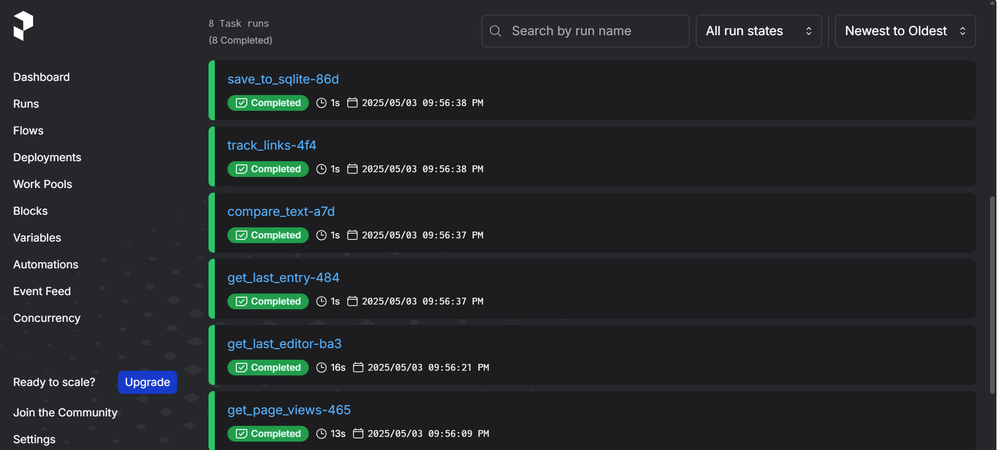
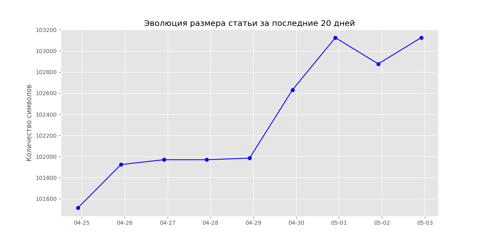
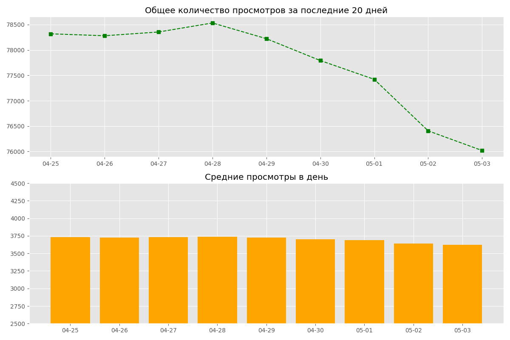

# Scraping Wikipedia article
 Проект для мониторинга изменений статьи в Wikipedia с сохранением истории правок и статистики просмотров
## Основные возможности
- Автоматический запуск скрапера каждые 24 часа
- Сбор данных из статьи:
  
                  -> Заголовок
  
                  -> Количество символов в статье
  
                  -> Содержимое статьи
  
                  -> Дата последнего изменения
  
                  -> Автор последних изменений
  
                  -> Внутренние и внешние ссылки
  
                  -> Дата сбора данных
  
                  -> Общее количество просмотров статьи за последние 20 дней
  
                  -> Среднее количество просмотров статьи в день
  
- Сохранение результатов в базе данных
- Анализ изменений в статье
- Визуализация данных

## Технологический стек
При создании проекта использовались:

**Prefect** - планирование задач и автоматический запуск

**Selenium** - автоматизация браузера для парсинга

**BeautifulSoup** - обработка HTML

**SQLite** - хранение информации в базе данных

**Webdriver Manager** - автоматическое управление драйверами

## Запуск проекта
Для запуска проекта требуется **создать копию репозитория** локально. Для этого можно воспользоваться командой 
`git clone https://github.com/Anastasia-l/Scraping_Wiki_Article` и скопировать репозиторий в отдельную директорию.

Затем необходимо **установить** зависимости из **requirements.txt**:

`pip install -r requirements.txt`

Следом нужно **запустить Prefect** при помощи команды
`prefect server start`

Сервер будет доступен по адресу:
 http://127.0.0.1:4200

  

После запуска сервера Prefect требуется **запустить wiki_parce.py** - сделать это можно через интерпретатор или через консоль с командой:
`python wiki_parce.py` 

Таким образом проект будет настроен на автоматический запуск каждые 24 часа, а собранные **данные будут храниться** и автоматически обновляться **в** базе данных **wiki_history.db**.

Запуск и управление также доступны через **интерфейс Prefect**: http://127.0.0.1:4200

 
 

Также **для выполнения первого запуска** можно воспользоваться командой:
`prefect agent local start` 
это запустит процесс скрапинга без ожидания 24 часов перед первым запуском. 

 
 

Для остановки процесса сбора данных необходимо **остановить сервер**
`prefect server stop` 
или отменить его в интерпретаторе. Также все управление деплоями возможно через пользовательский интерфейс Prefect.

## Визуализация и анализ данных

- Собранные данные сохраняются в базу данных **wiki_history.db**
- Анализ и визуализация данных запускаются через **main_visualiser.py**:
`python main_visualiser.py`- при этом автоматически создаются изображения графиков и диаграмм на основе базы данных (plot_1.png и plot_2.png), а также статистика по статье, которая выводится в консоли, либо автоматически записывается в файл **stats_report.txt**.

